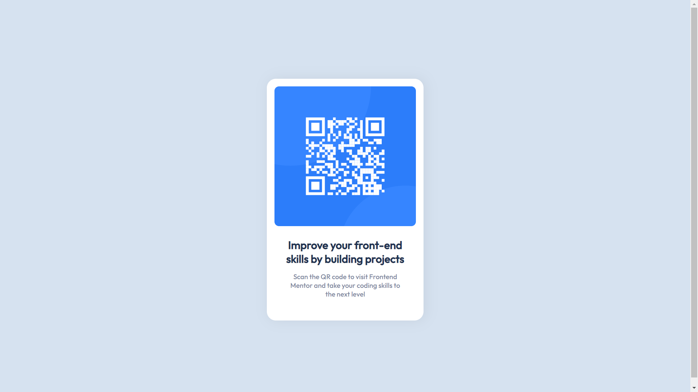

# QR-CODE-COMPONENT
FIRTST CHALLENGE OF FRONTENDMENTOR.IO.
This is my first solution to the [QR code component challenge on Frontend Mentor]. 

### Screenshot

### Built with

- Semantic HTML5 markup
- CSS custom properties
- Flexbox
